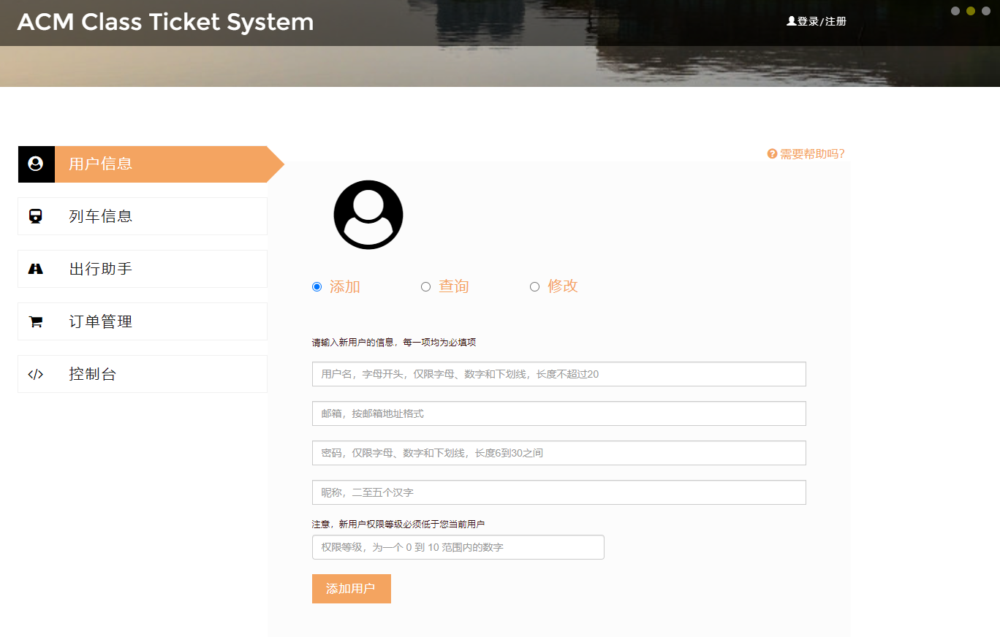
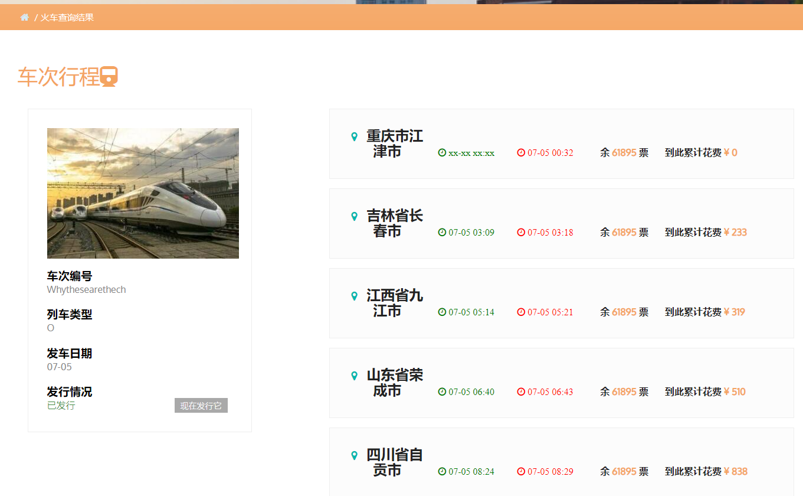

# ACM Class-TicketSystem 使用手册

> Dirty Deeds Done Dirt Cheap, Love Train!


### 0 简介

本项目为 ACM 班 CS147 数据结构课程大作业。

项目可分解为前端部分与后端部分。

其中，前端部分基于 Python 的 Flask 框架与 Jinja2 渲染模板开发。前端部分架构详见下文的**管理人员需知部分**。

后端部分为 C++ 编写的，借助 BPlusTree 实现数据管理的一个火车票逻辑系统。其已通过严格的正确性检验并且打包为 `code` 可执行文件，如无必要请勿修改。

**如果您为此系统的普通用户**，请跳过 **1、2 部分**，从 **3 部分**及以后获得你想要的相关使用教程指导。

**如果您为此系统的管理人员**，且需要获得项目部署、维护等相关信息，请仔细阅读 **1、2 部分**。


### 1 前端文件与维护指南

正常途径获取本项目的部署包应该是一个 `FrontEnd` 文件夹，结构如下：

```tex
└── FrontEnd
    ├── static
    │   ├── css
    │   ├── doc
    │   ├── fonts      
    │   ├── images       
    │   └── js      
    ├── templates
    │   ├── index.html
    │   └── result.html
    ├── code
    ├── app.py
    └── core.py
```

其中 `static` 为资源文件，其中子文件的内容较多所以在下面详述：

**css**

```text
bootstrap.css
bootstrap-select.css
creditly.css
easy-responsive-tabs.css
flowChart.css
font-awesome.css
jquery.seat-charts.css
jquery-ui.css
layout.css
style.css
xtiper.css
xui.css
```

**doc**

帮助文档路径位置

**fonts**

```
fontawesome-webfont
glyphicons-halfings-regular
FontAwesome
Montserrat-Regular
OpenSans-Regular
Oxygen-Regular
```

**images**

```
1.jpg & 2.jpg & 3.jpg
favicon.ico
top-arrow.png
train.jpg
```

**js**

```
bootstrap.js
bootstrap-select.js
contact_me.js
creditly.js
dynamic_timeline.js
easing.js
easyResponsiveTabs.js
jqBootstrapValidation.js
jquery.seat-charts.js
jquery-2.2.3.min.js
jquery-ui.js
move-top.js
responsiveslides.min.js
xtiper.min.js
validator.js
```

可能出现的问题？

- 网页显示异常：请仔细查看两个 `html` 文件，其中 `index.html` 为主页面，`result.html` 为所有操作结果的呈现页，通过 Jinja2 传入参数 `query_name` 来选择性渲染。
- 数据丢失、异常：请仔细检查本地的数据文件是否损坏。`code` 将会在**它的目录下**生成对应的数据文件，格式均为 `*.bin` 。此外，本系统还有设置登陆状态的 `cookies`，这点也需多多注意。
- 文件丢失：请重新下载完整部署包。
- 其它可能的异常：本系统在你的服务器终端会输出比较详细的调试信息，以及各个命令的格式化显示，可以借助这个更好地进行维护。

为了管理员更方便地维护，我们提供了一个类似后端部分的**命令行终端**。格式化命令详情参见 README.md。


点击”执行“后会展示运行结果，呈现方式为一个仿 Linux 终端界面。


### 2 项目部署指南

首先，你需要获得上述的完整部署用文件夹 `FontEnd`。

- 安装 Flask 包

```
python3 -m pip install flask
```

详细可查看 Flask 官方文档 https://dormousehole.readthedocs.io/en/latest/ 

- 本地启动

在 `FontEnd` 文件夹下，运行

```
python3 app.py
```

部署成功


- 进行测试

初始化系统时，会自动创建一个权限为 10 的超级管理员，初始化信息在 `core.py` 内修改：


### 3 有关输入检查系统

本系统自带基于正则表达式的**较严格的输入检验**。实现见 `validator.js`

每当您填写某一表单时，填写结束后系统会利用悬浮消息自动提示填写情况。

注意，为防止非法输入造成的可能问题，如果您的输入不合法，系统将会在提示后**清空该输入**。

如下是不合法时会出现的提示，它位于界面的中间位置。


输入规范大多以提示字样出现在对应填写界面。

如果您对某些输入格式还有疑问，下面提供了一张清单供您随时查询。（修改自 `README.md`）


***Appendix 输入格式清单***

- **用户名：** 用户的唯一标识符，由字母开头，字母、数字和下划线组成的字符串，长度不超过20。
- **密码：** 由字母、数字和下划线组成的字符串，长度不低于6，不超过30。
- **昵称：** 由二至五个汉字组成的字符串。
- **邮箱：** 同一般邮箱地址格式，且仅含数字、大小写字母，`@`和`.`，长度不超过30。（**不检验**邮箱格式的合法性）
- **用户权限：** 所处用户组优先级，为一个0~10的整数。

- **车次编号：** 车次的唯一标识符，由字母开头，字母、数字和下划线组成的字符串，长度不超过20。

- **车站数量：** 车次经过的车站数量，为大于1且不超过100的整数。

- **站名：** 车次经过的所有车站名，站名由汉字组成，不超过10个汉字。

- **座位数：** 该车次的座位数，为不超过100000的整数。

- **到下站票价：** 每两站之间的票价，是一个不超过100000的整数。

- **到下站历时：** 每两站之间行车所用的时间（单位为分钟），是一个不超过10000的整数。

- **停靠时长：** 除始发站和终点站之外，列车在每一站停留的时间（单位为分钟），是一个不超过10000的整数。

- **列车类型：** 列车类型，为一个大写字母。


### 4 用户相关部分

**当你需要查询、管理用户信息时，请访问此页面。**

接下来的部分为普通用户使用该系统的指南。

通常，第一次访问时你应该是未登录状态，界面大概如下：



你可以通过 ”需要帮助吗？“ 这一入口随时找到我们。

你应该首先进行右上角的”注册“操作。注册默认创建一个**权限为 1** 的账号。


注意用户名重名或注册信息填写不符要求都会导致注册失败。

注册结束后，请在同样的窗口进行登录。

- Q：用户的添加、查询、修改对普通用户开放吗？

  A：暂时开放。请留心系统给出的所有注释。


### 5 列车相关部分

**当你需要查询、管理火车信息时，请访问此页面。**

对于一个列车，我们需要添加其经过的站数以及各个站的信息。

在该系统，可以看到填写表单里有一处站数的填写处，下方的路线图会根据站数即时拉长。

起点站、终点站的部分参数是无意义的，不必也无法填写。

查询一个火车得到的界面大致如下：



左侧为该车次的基本信息，你可以在此页面发行该火车，也可以选择在列车信息的”操作“栏里发行它。已发行的火车按钮显示为灰色。

右侧为该火车当天的行程表，其中标为绿色的时间表示其**到达该站点的时刻**，红色的时间表示其**离开该站点的时刻**。无意义的数据显示为 x。

- Q：火车的图片是该火车的预览图吗？

  A：否，只是装饰图片。


### 6 出行相关部分

**当你需要拟定出行计划时，请访问此页面。**

本系统目前只支持不换乘的车票查询，以及**只换乘一次**的最优方案查询。

最优方案大致呈现方式如下。


每次查询一个出行方案，你都需要选择要你关心的优先级：时间短优先还是费用低优先。

优先级高的方案会优先被呈现，在车票查询中会出现在表单更上面。


车票查询界面还提供了购票渠道，可以直接在此进行购票。

购票后会自动帮你填好大部分表单，你只需要选择订单数量，然后提交订单。


- Q：价格均打 1 折是？

  A：是本系统独占大力度优惠。


### 7 订单相关部分

**当你需要下单，或者查询、退订订单时，请访问此页面。**

下单时，请注意自己是否接受候补购票。


接受候补购票后，若余票不足，如果订单数未超过车辆总座位数，系统会将您的订单放入候补队列。

当有人退票让出足够的余票后，会按时间先后顺序第一时间从候补队列中选择合法的订单，其立即购买成功。

一个查询完毕的订单结果大致如下，其中订单状态共有三种：Success（成功购票）、Pending（位于候补队列）和 Refunded（已退票）。


对于未退票的订单，你可以在该页面随时通过右侧按钮进行退票。

- Q：退票后订单会一直保留在我的购票记录上吗？

  A：会的。


### 8 退出系统

如果您为普通用户，直接退出网页即可。您的浏览器很可能保留了您的登录 cookie，所以下次进入系统会自动登录。清除浏览器的 cookie 可以防止这一点。

如果您为管理员，想要停止系统，可以在服务器终端结束 Flask 进程。**注意不要非正常退出**，以免数据丢失。 