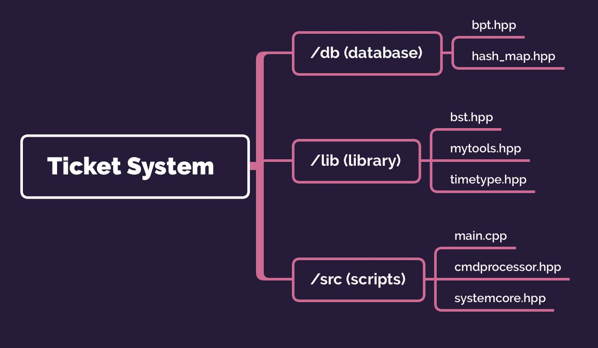
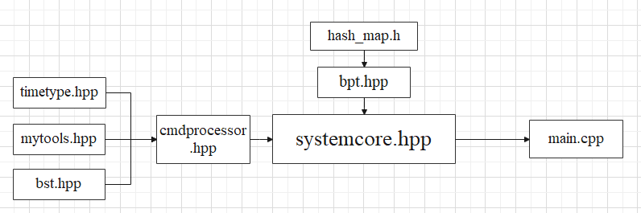
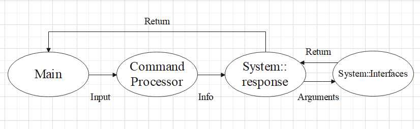

# ACM Class-TicketSystem 开发文档

> Dirty Deeds Done Dirt Cheap, Love Train!


### 0 简介

- **项目性质** 本项目为 ACM 班 CS147 数据结构课程大作业。

- **开发周期** 项目开发始于 26 Apr，于 24 May 第一次通过 OJ 测试。

- **开发团队名**  [@PingPong Doubles Smash Locomotive](https://github.com/SiriusNEO/ACMClass-TicketSystem)

> 希望我们的代码能像乒乓球的扣杀一样又快又狠


| 组员                                              | 分工                                     |
| ------------------------------------------------- | ---------------------------------------- |
| 林超凡 [@SiriusNEO](https://github.com/siriusneo) | 后端逻辑，调试与性能优化，前端（待定？） |
| 王崑运 [@wangky-ac](https://github.com/wangky-ac) | B+树，缓存实现                           |

- 目前共有两个版本：

其中 `TicketSystem-FasterVersion` 加了一些~~毒瘤的~~相关优化，且输入输出为了效率使用了 `fgets/fwrite`，仅用于 OJ 评测。

`TicketSystem-Standard` 相关设计更加规范化（如统一返回 `std::string` ），用于与前端对接。

- ~~另：挑战火车票AC最短码 核心部分逻辑仅500行出头！~~


### 1 整体架构

- **文件架构**

  

     共三个文件夹，8 份代码文件。

  - `/db`  文件管理数据结构相关。其中 `bpt.hpp` 为 B+树与缓存主体，`hash_map.hpp` 为缓存所用的哈希表。**(Contributed by wanky-ac)**
  - `/lib`  为逻辑部分实现细节上的引用主库，包括一棵用于维护登录状态的二叉树 `bst.hpp`，杂工具集合 `mytools.hpp` 以及时间类 `timetype.hpp` **(Contributed by SiriusNEO)**。
  - `/src`  为主要代码，包括一个 `main.cpp`，火车票核心部分 `systemcore.hpp` 以及用于翻译、处理读入的格式化命令的 `cmdprocessor.hpp` **(Contributed by SiriusNEO)**。

-  **引用示意图**

  

  其中单向箭头表示头文件引用方向。

- **命令传递示意图**

  


### 2 类与成员的设计

- 总系统

  - `class System`  

    火车票系统类，包含所有操作的对应函数接口，并通过调用数据库对所有数据进行管理。User 相关、Train 相关、Order 相关部分均为其成员。

- Command Processor 中

  - `struct cmdType`  

    封装好的一个信息包，解析自输入的一行命令。信息包括：命令编号，参数列表（参数按输入时的字母 `a-z` 储存，不存在留空）

- User 相关

  - `struct User`  

    用户类，成员中没有储存 `Username`，因为任何情况下这都是可知的。

  - `Bptree userDatabase`  

    用户数据库，`Username` -> `User` 

  - `BinarySearchTree loggedUser`   

    当前已登录用户记录，存于内存中，`Username` -> `priviledge` ，这样设计是因为 `priviledge` 被调用得较为频繁。

    （为什么选用二叉查找树？因为随机情况下复杂度是 $$\log$$ 级别的，并且由于操作简洁似乎表现上优于哈希表）

- Train 相关

  - `struct Train` 

    火车数据类，包含一辆完整火车的信息。其中价格与时间经过前缀和处理。

  - `struct DayTrain`  

    火车发行后，不同日期、不同 `trainID` 的火车都是独立的车次，需要维护它们的座位信息，封装为 `DayTrain`。

  - `struct Station`   

    某一 `trainID` 的火车上的某一站的信息（虽然站相同，但在不同火车上的它们是不同的），方便之后 `query_ticket` 与 `query_transfer` 的操作。

  - `struct Ticket`  

    票类，用于 `query_ticket` 排序。成员包含两个 `Station` 类，分别对应起始站、终末站。

  - `Bptree trainDatabase`  

    火车数据库，`trainID` -> `Train` 

  - `Bptree dayTrainDatabase `   

    车次数据库，`(Day, trainID)` -> `DayTrain`，维护座位时调用。

  - `Bptree stationDatabse`  

    某一车次的站数据库，用于快速查找“经过某一站的火车有哪些，这一站在这辆火车上的位置如何”这种信息。`(StationName, trainID)` -> `Station`

- Order 相关

  - `struct Order` 

    订单类，包含一份订单的完整信息。

  - `struct PendingOrder`  

    队列中的订单信息，只保留了 `Order`  中的有用信息用于补票。

  - `Bptree orderDatabase`  

    查询订单数据库，由于要配合 `query_order` 在 key 中加入了 `Username` ，`(Username, OrderID)` -> `Order`

  - `Bptree pendingQueue`  

    候补订单，只有同一车次上的订单之间存在候补的可能，因此索引为车次的信息，`(Day, trainID, OrderID)` -> `PendingOrder`

- Library 中

  - `template <int SIZE> struct FixedStr`  

    封装好的定长字符串类。该系统中所有字符串信息均为 `FixedStr` 不同长度的模板实例。提供了基本的字符串接口以及与 `std::string` 的互相转换接口。

  - `class TimeType`  

    时间类，实际数据为一个 `int` 变量，表示从 `2021-01-01` 开始过了几分钟。提供了通过 `Month-Day Hour:Minute` 格式的字符串构造的途径，能够快速获取日期、时刻，同时也可转化为 `Month-Day Hour:Minute` 格式的字符串。
  
    注：此时间类精确到分钟，仅能在 2021 年范围内工作。
    
    

### 3 函数接口

- System 中

  - `response(const cmdType&)`  

    根据给定信息包中的命令编号，通过函数指针的方式调用对应接口，同时接受其返回值再输出给主函数。

    返回类型：`FasterVersion` 中为 `bool`，表示是否结束程序；`Standard` 为 `std::string`，表示命令执行的输出结果。

  - `Interfaces(const cmdType&)[]`  

    此为一系列函数，负责各个功能的具体实现。

    
    
    返回类型：`FasterVersion` 中为 `int`，表示执行结果的类型；`Standard` 为 `std::string`，表示命令执行的输出结果。

- Command Processor 中

  - `cmdType parse(const std::string&)`  

    解析输入的命令字符串，返回信息包。

- Library 中

  - `int stringToInt(const std::string&)`  

    字符串转 int。int 转字符串使用了 `std::to_string`。

  - `std::string dateFormat(int num)`  

    负责日期类的补零操作。如：输入 `3`，返回 `"03"`

  - `void split(const std::string&, std::string ret[], int& retc, char)`

    分割函数，输入一个字符串以及分隔符，返回一个分割后的字符串数组 `ret[]` 以及分割的段数 `retc`，使用引用返回。

  - `template<class T> void qsort(T*, T*, bool (*cmp)(const T&, const T&))`  
  
    快速排序，参数依次为头指针、尾指针与比较函数。注意尾指针是包含于排序的！
  
  - `hashCode hash(const char*)`  
  
    简单的利用自然溢出的哈希函数，`hashCode` 在代码里定义为 `unsigned long long`。
  
  - `void write(const char*)`  与  `void writeInt(int)`   
  
    快速输出，`FasterVersion`  限定。
  
  

### 4 关键部分算法设计

-  **query_ticket**

  - 查找经过起点站的车次 `sList` 、终点站的车次 `tList`

    有一个为空说明没有符合条件的车次

  - 均非空，两两枚举车次对，有以下要求：

    - `trainID` 相等，因为不允许换乘。

    - 由于要在 `day` 这一天**上车**，计算出对应的火车发站时间 `startDay`，

      则这个 `startDay` 要在 `trainID` 的售卖范围内。

      注意不是 `day` 在范围内。给一个反例：

      > 火车售卖区间 08-01 ~ 08-02，到达 A 站距离出发 3 天，
      >
      > 应该要查到 08-04 的票！

    - 起点站要在终点站的左边。有两种比法：

      比 index  或者 **离开起点站时间要早于到达终点站时间**

  - 符合以上条件就是合法的票了，加入答案序列。

- **query_transfer**

  - 查找经过起点站的车次 `sList` 、终点站的车次 `tList`

    有一个为空说明没有符合条件的车次

  - 均非空，两两枚举车次对。

    考虑这两辆车先后的一次 transfer. 有以下要求：

    -  `trainID` 要**不同**

    - 由于要在 `day` 这一天**上车**，计算出对应的火车发站时间 `startDay1`，

      则这个 `startDay1` 要在**第一辆车**的售卖范围内。

    - 两者的时间条件：第一辆车到达那一天之后，第二辆车必须**存在一天有卖票**

  - 现在枚举中转站。
  
    暴力思路：枚举第一辆车起点站往后的站，第二辆车终点站往前的站。
  
    优化思路：先把这些站进行排序，利用双指针跳。
  
    考虑这个站作为中转站，则：

    - 两站名字相同。

    - 时间顺序：考虑在 `day1 ` 上第二辆车，则其对应的发站时间必须落在第二辆车销售范围内。

      上第二辆车的时间范围为 [第一辆车到达日，无穷]，因此不用考虑是否会小于第二辆车的开始售卖日，只要关心是否大于结束售卖日。

      最快上第二辆车的时间：第一辆车到达日，对应发站时间 `fastestStartDay2`

      如果它都大于，那其它发站时间肯定更长。

      如果它小等于，说明最快一定能赶上。这时候要看什么时候开始卖，也许太快了人家还没开始卖，要等到开始卖。
      
      

### 5 B+树与缓存设计、Disk_manager

- 缓存设计：

  - 主体部分:一个双端链表、一个hashmap.
  - 具体设计:
    - 将文件中的节点或者序中新增的节点加入双端链表的头部(指针)，同时，在hashmap中存入双端链表中的节点，以便后续中的查找。
    - 当节点超过限制时，将节点写入文件，并在内存中删除，新插到双端链表的头部
    - `recycle_pool`  负责回收空间
    - `disk_manager`  负责所有的文件操作，为了效率，采用 FILE* 进行相关操作

- B+树设计：

  - 初始化：

    如果程序是第一次运行，新建文件，写入`basic_infomation`、`recycle_pool`、`root`；

    如果不是，则将基础信息读入

  - 基础结构：

    - 节点设计：

      ```c++
      key_offset little_node[MAX_SIZ + 1];
      sjtu::pair<Node *, int> father;int this_node_off=0;
      int r_node_off=-1;
      bool is_leaf=false;
      int siz=0;
      /*
      * 叶子节点和中间节点在结构上是完全一样的
      * 叶节点，关键信息为一个pair数组，存key值和value的offset。其中，叶子节点pair数组中，pair[0]不存任何信息。
      * 中间节点，关键信息为一个pair数组，存key值和子节点的 offset 。
      */
      ```

      其中，pair[0].second存子节点的offset，但是，pair[0].first不存信息，因为其中的信息(key)上调给父节点了。

      father在设计理念上是一个中间量，在search操作中进行更新,所以修改节点后，不用更改它的father信息。

    - B+树的阶数大小设计：

      `static const int MAX_SIZ = (4096 - sizeof(int)*3 -  sizeof(bool)-sizeof(sjtu::pair<Node *, int>)) / sizeof(key_offset)-1;`  

      这样设计是为了尽量使一个节点占用一个磁盘扇区。

    - `basic_info` 类设计：

      储存树的基本信息。

      成员包括：

      ```c++
      int root_offset=-1;  
      int values_num=0;  
      char file_name1[25]={0};  
      char file_name2[25]={0};
      ```


      其中两个文件名分别为储存节点与基本信息的文件与储存value的文件的名字。

  - 关键操作接口：

    以下为对外接口

    - `bool insert(const Key &key, const Value &value)` 

      负责单点插入节点，**保证 `key` 不重复**。

    - `bool erase(const Key &key)` 负责单点删除节点。

    - `std::pair<Value, bool> find(const Key &key)` 

      负责单点查找节点，其中返回类型为 `std::pair`，第二分量表示查找是否成功，第一分量表示找到的值。

    - `void range_find(const Key &key_low, const Key& key_high, value_type* ret, int& retCnt)` 

      范围查找，查找 key 值在 `key_low` 与 `key_high` 之间（闭区间）的节点，采用引用返回。

      > 接口修改 by SiriusNEO，主要为了去除 `std::vector` 的使用

    - `bool modify(const Key &key, const Value &value)`  

      负责单点修改，返回修改是否成功。

    - `bool modify_info(const Key &key, const T& info, size_t offset)`  

      单点的，对类成员的修改，第二个参数为某一成员类型，第三个参数为此成员在该类型内部的偏移量。

      > 接口设计 by SiriusNEO，主要为了加速某些特定修改（如改变火车 `isReleased` 状态，改变订单状态）

    以下为 B+ 树内部接口

    - `split` 负责将节点裂开，其中，叶子节点和中间节点的split操作具有很大区别。
    - `merge` 负责将节点合并，其中，叶子节点和中间节点的merge操作具有很大区别。


### 6 开发日志

##### 第9周 / 火车票 Week 0
本周期中周，考数学、物理，因此摸一周
下周正式开始大作业

##### 第10周 / 火车票 Week 1

分工完成，但也没怎么动（~~摸，都可以摸~~）。

##### 第11周 / 火车票 Week 2

五一放假，摸了

##### 第12周 / 火车票 Week3

终于开工了x  逻辑部分通过了所有本地测试点，并且搭载块链第一次交上了 OJ

[](https://user-images.githubusercontent.com/41781658/118356458-e3be5680-b5a7-11eb-9683-1c7c2468a3ac.png)

B+树大体也写完了，不过存在数据量过大 RE 的 Bug

##### 第13周 / 火车票 Week 4

借用学长的B+树，逻辑部分终于完成了第一次AC。

[](https://user-images.githubusercontent.com/41781658/118819096-96afec80-b8e7-11eb-81ac-590dbba1f77f.png)

同时B+树也找了Bug：一个需要new的节点忘记new了，一些部分（recycle_pool）没有赋初值。

进行联合调试，在一行行代码的仔细复查下，终于找出 Bug：若干没有删除的注释

同时进行了少量优化，最后得到了第一次完全不含非法容器的提交

[](https://user-images.githubusercontent.com/41781658/119225087-55604c80-bb34-11eb-8c3c-00fd9d892cc6.png)

优化内容如下：

- 联合调试结束，优化B+树阶数（optimized 549929ms）
- 去除 `std::vector`，速度有所下降（739169ms）
- 输出优化，速度极大提高（398438ms）（注意前端对接要用另一份！）
- `query_tranfer` 算法优化，$$O(n^2)$$ 枚举站口 $\rightarrow$ $$O(n \log n)$$ 枚举站口（398634ms） 
- `hash ` 优化，减少 B+树 内部比较（Wrong Answer 风险？308015ms） 

##### 第14周 / 火车票 Week 5

继续不断优化...

- 进一步优化了 `query_ticket`，减少了一次文件读写。
- `cache` 大小重新调整。
- 输入优化。

最后终于在 OJ 上正式取得 AC，贺电！

